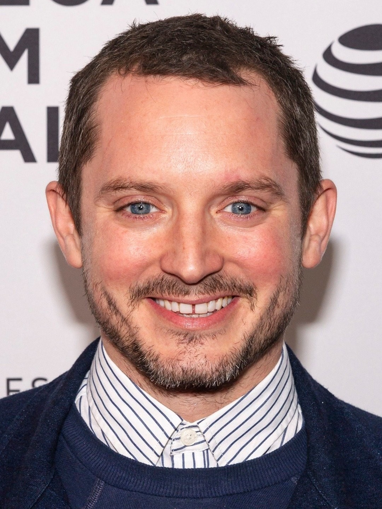

# Hobbit Face SVM Classifier  (README WIP)

**Skills:** `Python | NumPy | Pandas | Matplotlib | OpenCV | PyWavelets | scikit-learn | HTML | CSS | JavaScript`

**Tools:** `Jupyter Notebook | VS Code | PyCharm | Flask`

##### [See my other projects!](https://github.com/aJustinOng)

---

## Overview

This project is based on CodeBasic's [Sports Celebrity Image Classification](https://www.youtube.com/playlist?list=PLeo1K3hjS3uvaRHZLl-jLovIjBP14QTXc) project.

I was inspired to make this classification project when my friends started making plans to get together to watch the LOTR (Lord of the Rings) trilogy again. Hobbits are a race in the Tolkien franchise, and in the movies they are played by several well-known Hollywood actors such as Elijah Wood and Martin Freeman. I thought, since they are all male caucasian actors and played similar roles in the movies, can I build a model that can classify between them?

So I searched for and downloaded 50 images for each of the chosen five hobbit actors (Elijah Wood, Sean Astin, Billy Boyd, Dominic Monaghan, and Martin Freeman) on Google. For the preprocessing, I used OpenCV's Haar cascade classifiers to detect faces and eyes in those images, filtering out the unideal training images. I then stored the cropped facial regions into a separate folder before using PyWavelets to extract the facial regions from them. The combined images of both the original cropped image and Wavelet transformed image were split into train and test sets, which were finally used to train a SVM (support vector machine) model. I used GridSearchCV to determine the best model and parameters. After exporting the model as a Pickle file, I loaded it in a Flask server that was connected to a HTML/CSS/JavaScript webpage. The webpage allows the user to drop in an image to classify which of the five hobbits the image resembles. It also displays the confidence of the model and can detect multiple faces in a single image.


## Table of contents:
1. [Data Collection from Google](#1-data-collection-from-google)
2. [Importing Libraries and Data Loading](#2-importing-libraries-and-data-loading)
3. [Image Preprocessing: Data Cleaning](#3-image-preprocessing-data-cleaning)
4. [Image Preprocessing: Feature Engineering](#4-image-preprocessing-feature-engineering)
5. [Model Building Using SVM](#5-model-building-using-svm)
6. [Creating a Python Flask Server](#6-creating-a-python-flask-server)
7. [Creating a User-Friendly Webpage](#7-creating-a-user-friendly-webpage)
8. [Bonus: More Faces?](#8-bonus-more-faces)
9. [Summary](#summary)

## 1. Data Collection from Google

Since the theme of this project was hobbits, we will be classifying between five actors who have played the role in the Tolkien franchise: **Elijah Wood**, **Sean Astin**, **Billy Boyd**, **Dominic Monaghan**, and **Martin Freeman**. In the movies they played the hobbits Frodo Baggins, Samwise Gamgee, Peregrin (or Pippin) Took, Meriadoc (or Merry) Brandybuck, and Bilbo Baggins, respectively. Let us stick with the actors' names for the meantime. We will not worry too much about the hobbit names until we get to the webpage UI.

In an image classification project, a collection of good quality images of each classification object (in this case, faces of the actors) is required to train our model. I tested several image web scraping tools but they were not very effective being only able to scrap the image thumbnails on Google, resulting in poor quality images around 100px-200px in width/height. Web scraping has become more and more controlled in the recent years, so it may not be the way to go for this project. Since we are only classifying between five faces, I spent a couple hours manually clicking through and downloading 50 high quality images for each actor (250 images in total). Although tedious, this helps with the preprocessing as well since there will be few unsuitable training data (like faces of other people or obstructed faces). I placed these images in subfolders named after their respectively actors (e.g. path in repo: `model -> data -> dataset -> elijah_wood`)

> Note: If you have trouble in manually downloading images in a consistent .jpg or .png format, a image format converter browser extension is very helpful. They help minimize problems with difficult formats like WEBP files. Extensions also tend to come and go so any on the Chrome extension store should work well.

Some examples of the images we will be using:

`model/data/dataset/elijah_wood/19046_v9_bb.jpg:`



`model/data/dataset/elijah_wood/019c63_92e16961e1ca4d8589b03b451.jpg:`


## 2. Importing Libraries and Data Loading

### 2.1 Install Necessary Libraries

These are the required library installations and their specific versions I used for this project (written in `requirements.txt`:

```
PyWavelets==1.7.0
opencv-python==4.11.0
seaborn==0.8.1
```

We can quickly install these libraries in `requirements.txt` by using the following command in the command prompt:

```
pip install -r requirements.txt
```

### 2.2 Import Libraries

After successfully installing those libraries, we can create a new Jupyter Notebook and import the common libraries:

```
import numpy as np
import cv2
import matplotlib
from matplotlib import pyplot as plt
%matplotlib inline
```

### 2.3 Load Data

We can use `cv2` to read images and plot them. Let us load an image in the `test_images` folder:

```
img = cv2.imread('./data/test_images/image_1.jpg')
plt.imshow(img)
plt.show()
```


We will use this image to demonstrate our image preprocessing with data cleaning and feature engineering.

## 3. Image Preprocessing: Data Cleaning

## 4. Image Preprocessing: Feature Engineering

## 5. Model Building Using SVM

## 6. Creating a Python Flask Server

## 7. Creating a User-Friendly Webpage

## 8. Bonus: More Faces?

## Summary

