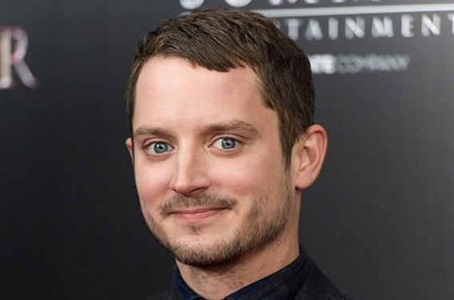

# Hobbit Face CNN Classifier 

**Skills:** `Python | NumPy | Pandas | Matplotlib | OpenCV | PyWavelets | scikit-learn | Keras | HTML | CSS | JavaScript`

**Tools:** `Jupyter Notebook | VS Code | PyCharm | Flask`

##### [See my other projects!](https://github.com/aJustinOng)

---

## Overview

This project is based on CodeBasic's [Sports Celebrity Image Classification](https://www.youtube.com/playlist?list=PLeo1K3hjS3uvaRHZLl-jLovIjBP14QTXc) project.

I was inspired to make this classification project when my friends started making plans to get together to watch the LOTR (Lord of the Rings) trilogy again. Hobbits are a race in the Tolkien franchise, and in the movies they are played by several well-known Hollywood actors such as Elijah Wood and Martin Freeman. I thought, since they are all male caucasian actors and played similar roles in the movies, can I build a model that can classify between them?

So I searched for and downloaded 50 images for each of the chosen five hobbit actors (Elijah Wood, Sean Astin, Billy Boyd, Dominic Monaghan, and Martin Freeman) on Google. For the preprocessing, I used OpenCV's Haar cascade classifiers to detect faces and eyes in those images, filtering out the unideal training images. I then stored the cropped facial regions into a separate folder before using PyWavelets to extract the facial regions from them. The combined images of both the original cropped image and wavelet transformed image were split into train and test sets, which were finally used to train a SVM (support vector machine) model. I used GridSearchCV to determine the best model and parameters. After exporting the model as a Pickle file, I loaded it in a Flask server that was connected to a HTML/CSS/JavaScript webpage. The webpage allows the user to drop in an image to classify which of the five hobbits the image resembles. It also displays the confidence of the model and can detect multiple faces in a single image.


I was not satisfied with the model's accuracy, so I went back to the model-building process. Since SVM is considered outdated in modern image classification, I replaced it with a CNN (Convolutional Neural Network) approach. It skips the wavelet transforming process, since CNN can work directly with raw image pixels. It achieved an accuracy of 84.1% after 20-30 training epochs, a hefty 20% improvement from the SVM model.

## Table of contents:
1. [Data Collection from Google](#1-data-collection-from-google)
2. [Importing Libraries and Data Loading](#2-importing-libraries-and-data-loading)
3. [Image Preprocessing: Data Cleaning](#3-image-preprocessing-data-cleaning)
4. [Image Preprocessing: Feature Engineering](#4-image-preprocessing-feature-engineering)
5. [Model Building Using SVM](#5-model-building-using-svm)
6. [Creating a Python Flask Server](#6-creating-a-python-flask-server)
7. [Creating a User-Friendly Webpage](#7-creating-a-user-friendly-webpage)
8. [Next Steps: Improving Model](#8-next-steps-improving-model)
9. [Summary](#summary)

## 1. Data Collection from Google

Since the theme of this project was hobbits, we will be classifying between five actors who have played the role in the Tolkien franchise: **Elijah Wood**, **Sean Astin**, **Billy Boyd**, **Dominic Monaghan**, and **Martin Freeman**. In the movies they played the hobbits Frodo Baggins, Samwise Gamgee, Peregrin (or Pippin) Took, Meriadoc (or Merry) Brandybuck, and Bilbo Baggins, respectively. Let us stick with the actors' names for the meantime. We will not worry too much about the hobbit names until we get to the webpage UI.

In an image classification project, a collection of good quality images of each classification object (in this case, faces of the actors) is required to train our model. I tested several image web scraping tools but they were not very effective being only able to scrap the image thumbnails on Google, resulting in poor quality images around 100px-200px in width/height. Web scraping has become more and more controlled in the recent years, so it may not be the way to go for this project. Since we are only classifying between five faces, I spent a couple hours manually clicking through and downloading 50 high quality images for each actor (250 images in total). Although tedious, this helps with the preprocessing as well since there will be few unsuitable training data (like faces of other people or obstructed faces). I placed these images in subfolders named after their respectively actors (e.g. path in repo: `model -> data -> dataset -> elijah_wood`)

> Note: If you have trouble in manually downloading images in a consistent .jpg or .png format, a image format converter browser extension is very helpful. They help minimize problems with difficult formats like WEBP files. Extensions also tend to come and go so any on the Chrome extension store should work well.

Some examples of the images we will be using:

`model/data/dataset/elijah_wood/19046_v9_bb.jpg:`


`model/data/dataset/elijah_wood/019c63_92e16961e1ca4d8589b03b451.jpg:`



## 2. Importing Libraries and Data Loading

### 2.1 Install Necessary Libraries

These are the required library installations and their specific versions I used for this project (written in `requirements.txt`:

```
PyWavelets==1.7.0
opencv-python==4.11.0
seaborn==0.8.1
```

We can quickly install these libraries in `requirements.txt` by using the following command in the command prompt:

```
pip install -r requirements.txt
```

### 2.2 Import Libraries

After successfully installing those libraries, we can create a new Jupyter Notebook and import the common libraries:

```
import numpy as np
import cv2
import matplotlib
from matplotlib import pyplot as plt
%matplotlib inline
```

### 2.3 Load Data

We can use `cv2` to read images and plot them. Let us load an image in the `test_images` folder:

```
img = cv2.imread('./data/test_images/image_1.jpg')
plt.imshow(img)
plt.show()
```


We will use this image to demonstrate our image preprocessing with data cleaning and feature engineering.

## 3. Image Preprocessing: Data Cleaning

### 3.1 Detect Facial Features with Haar Cascades

To ensure that we have good training data, we want images where the person's face can be seen clearly. A good indicator of a clearly-seen face is when both eyes can be detected by the model. We can use OpenCV Haar Cascades to do that.

Files can be downloaded [here](https://github.com/opencv/opencv/tree/master/data/haarcascades). We will keep these files under the path `/opencv/haarcascades`.

Here is a good [article](https://pyimagesearch.com/2021/04/12/opencv-haar-cascades) by Adrian Rosebrock about OpenCV Haar Cascades. Key takeaways are that OpenCV uses a sliding window method, and during that process, it computes different features. It functions on the fact that on an image of a face, it will have both lighter and darker areas (e.g. the eyes, the sides of the nose, mouth). It recognizes patterns such as:

- Eye regions tend to be darker than cheek regions.
- The nose region is brighter than the eye region.

Even though there are more modern methods to facial recognition, Haar Cascades are extremely fast and sufficient for a project like this. However, its main weakness is that it is prone to false positives, detecting faces when there is none. We can reduce the chances of false positives by picking images with both a face and two eyes.

Let us start by converting the image into grayscale:

```
gray = cv2.cvtColor(img, cv2.COLOR_BGR2GRAY)
plt.imshow(gray, cmap='gray')
plt.show()
```


We then import the pretrained Haar Cascade data under `face_cascade` and `eye_cascade`.

```
face_cascade = cv2.CascadeClassifier('./opencv/haarcascades/haarcascade_frontalface_default.xml')
eye_cascade = cv2.CascadeClassifier('./opencv/haarcascades/haarcascade_eye.xml')
```

First, use `face_cascade` to attempt to detect a face in the image. We can draw a red box to visualize it.

```
faces = face_cascade.detectMultiScale(gray, 1.3, 5)
(x, y, w, h) = faces[0]

cv2.destroyAllWindows()
face_img = cv2.rectangle(img,(x, y), (x + w, y + h),(255, 0, 0), 2)
plt.imshow(face_img)
plt.show()
```


It detects a face as expected. We can do the same for each eye.

```
cv2.destroyAllWindows()
for (x, y, w, h) in faces:
    face_img = cv2.rectangle(img, (x, y), (x + w, y + h), (255, 0, 0), 2)
    roi_gray = gray[y:y + h, x:x + w]
    roi_color = face_img[y: y + h, x: x + w]
    eyes = eye_cascade.detectMultiScale(roi_gray)
    for (ex, ey, ew, eh) in eyes:
        cv2.rectangle(roi_color, (ex, ey), (ex + ew, ey + eh), (0, 255, 0), 2)
        
plt.figure()
plt.imshow(face_img, cmap='gray')
plt.show()
```


### 3.2 Crop the Facial Region of Image

The model is not interested in the rest of the image, so we can crop the image to just the area of the face.

```
%matplotlib inline
plt.imshow(roi_color, cmap='gray')
plt.show()
```


### 3.3 Crop Images if More Than Two Eyes

We can now write a function that returns a cropped image of the facial region, only if the it detects two or more eyes. We do two or more eyes is because it is possible for an image to contain multiple faces, and this model is also able to classify multiple faces.

```
def get_cropped_image_if_2_eyes (image_path):
    img = cv2.imread(image_path)
    gray = cv2.cvtColor(img, cv2.COLOR_BGR2GRAY)
    faces = face_cascade.detectMultiScale(gray, 1.3, 5)
    for (x, y, w, h) in faces:
        roi_gray = gray[y: y + h, x: x + w]
        roi_color = img[y: y + h, x: x + w]
        eyes = eye_cascade.detectMultiScale(roi_gray)
        if len(eyes) >= 2:
            return roi_color
```

```
original_image = cv2.imread('./data/test_images/image_1.jpg')
plt.imshow(original_image)
plt.show()
```


If we pass the previous image into the function, it returns the cropped image as expected.

```
cropped_img = get_cropped_image_if_2_eyes('./data/test_images/image_1.jpg')
plt.imshow(cropped_img)
plt.show()
```


What about a image where the face or eyes are obstructed?

```
orginal_image_obstructed = cv2.imread('./data/test_images/image_2.jpg')
plt.imshow(orginal_image_obstructed)
plt.show()
```


The function does not return anything, which is what we want.

```
cropped_image_no_2_eyes = get_cropped_image_if_2_eyes('./data/test_images/image_2.jpg')
cropped_image_no_2_eyes
```

### 3.4 Save Cropped Images

Now we can perform this process on the actual dataset and save the cropped images to a separate path. Declare the paths and use `os` to find the directory for each person.

```
path_to_data = "./data/dataset/"
path_to_cropped_data = "./data/cropped_images/"
```

```
import os
img_dirs = []
for entry in os.scandir(path_to_data):
    if entry.is_dir():
        img_dirs.append(entry.path)

img_dirs
```


Now use `os` to create directories to store cropped images for each person. We can use `shutil` to remove existing directories to avoid complications. 

```
import shutil
if os.path.exists(path_to_cropped_data):
    shutil.rmtree(path_to_cropped_data)
os.mkdir(path_to_cropped_data)
```

Our directories and paths are ready so we can now run the `get_cropped_image_if_2_eyes()` function on every image in our dataset.

```
cropped_image_dirs = []
hobbit_file_names_dict = {}
for img_dir in img_dirs:
    count = 1
    hobbit_name = img_dir.split('/')[-1]
    hobbit_file_names_dict[hobbit_name] = []
    for entry in os.scandir(img_dir):
        roi_color = get_cropped_image_if_2_eyes(entry.path)
        if roi_color is not None:
            cropped_folder = path_to_cropped_data + hobbit_name
            if not os.path.exists(cropped_folder):
                os.makedirs(cropped_folder)
                cropped_image_dirs.append(cropped_folder)
                print("Generating cropped images in folder: ", cropped_folder)
            cropped_file_name = hobbit_name + str(count) + ".png"
            cropped_file_path = cropped_folder + "/" + cropped_file_name
            cv2.imwrite(cropped_file_path, roi_color)
            hobbit_file_names_dict[hobbit_name].append(cropped_file_path)
            count += 1
```


## 4. Image Preprocessing: Feature Engineering

### 4.1 Use Wavelet Transform to Extract Facial Features

PyWavelets can be used to extract information from data like images and audio. A computer model cannot visually see images like we can, so we can use PyWavelets to perform wavelet transform on them, extracting facial features into data that is distinguishable by a computer.

The following code was taken from [a Stack Overflow thread](https://stackoverflow.com/questions/24536552/how-to-combine-pywavelet-and-opencv-for-image-processing). It combines OpenCV and PyWavelet for image processing.

```
import numpy as np
import pywt
import cv2    

# From stackoverflow
def w2d(img, mode='haar', level=1):
    imArray = img
    #Datatype conversions
    #convert to grayscale
    imArray = cv2.cvtColor(imArray,cv2.COLOR_RGB2GRAY)
    #convert to float
    imArray =  np.float32(imArray)   
    imArray /= 255;
    # compute coefficients 
    coeffs=pywt.wavedec2(imArray, mode, level=level)

    #Process Coefficients
    coeffs_H=list(coeffs)
    coeffs_H[0] *= 0;  

    # reconstruction
    imArray_H=pywt.waverec2(coeffs_H, mode);
    imArray_H *= 255;
    imArray_H =  np.uint8(imArray_H)

    return imArray_H
```

We can plot the wavelet transformed image:

```
img_har = w2d(cropped_img,'db1',5)
plt.imshow(img_har, cmap='gray')
plt.show()
```


### 4.2 Store Data in Dictionaries

We can create a dictionary to store a list of the paths of each image under each person, so we can easily access them later.

```
hobbit_file_names_dict = {}
for img_dir in cropped_image_dirs:
    hobbit_name = img_dir.split('/')[-1]
    file_list = []
    for entry in os.scandir(img_dir):
        file_list.append(entry.path)
    hobbit_file_names_dict[hobbit_name] = file_list
```

`hobbit_file_names_dict` has the following dictionary structure:

```
{
'billy_boyd': [
  './data/cropped_images/billy_boyd\\billy_boyd1.png',
  './data/cropped_images/billy_boyd\\billy_boyd10.png',
  './data/cropped_images/billy_boyd\\billy_boyd11.png',...]
'dominic_monaghan': [
  './data/cropped_images/dominic_monaghan\\dominic_monaghan1.png',
  './data/cropped_images/dominic_monaghan\\dominic_monaghan10.png',
  './data/cropped_images/dominic_monaghan\\dominic_monaghan11.png',...]
...
}
```

We will also label the five actors from 1-5 to easily reference them later.

```
class_dict = {}
count = 0
for hobbit_name in hobbit_file_names_dict.keys():
    class_dict[hobbit_name] = count
    count = count + 1
class_dict
```


### 4.3 Stack Cropped and Wavelet Transformed Images

We want to train the model with the both the original cropped image and the wavelet transformed image, so we can stack them using `numpy.vstack()`. They will end up looking like this:


`X` will contain the combined images and `y` will contain the classification (actor id from 1-5 that we set in `class_dict`).

```
X, y = [], []

for hobbit_name, training_files in hobbit_file_names_dict.items():
    for training_image in training_files:
        img = cv2.imread(training_image)
        if img is None:
            continue
        scaled_raw_img = cv2.resize(img, (32, 32))
        img_har = w2d(img,'db1',5)
        scaled_img_har = cv2.resize(img_har, (32, 32))
        combined_img = np.vstack((scaled_raw_img.reshape(32*32*3,1),scaled_img_har.reshape(32*32,1)))
        X.append(combined_img)
        y.append(class_dict[hobbit_name])
```

Lastly, we reformat the `X` values from `int` to `float`. It is optional but we want to avoid scikit-learn int warnings. `X` will have a shape of (218, 4096).

```
X = np.array(X).reshape(len(X), 4096).astype(float)
X.shape
```

218 is the number of training images (filtered from our original 250 image dataset) and 4096 is the size of each image. The size of each image is 4096 because the array of the RGB image is 32 x 32 x 3 and the wavelet transformed image is 32 x 32 x 1, totaling to 4096 (3072 + 1024).
 
## 5. Model Building Using SVM

### 5.1 Build SVM Model

We can now start the SVM (Support Vector Machine) model building process. We will use SVC (Support Vector Classification) for this model. Start by importing the necessary scikit-learn libraries:

```
from sklearn.svm import SVC
from sklearn.preprocessing import StandardScaler
from sklearn.model_selection import train_test_split
from sklearn.pipeline import Pipeline
from sklearn.metrics import classification_report
```

After we train and test the model, we get quite a poor result of `0.63636` from a dataset of 55 test images.

```
X_train, X_test, y_train, y_test = train_test_split(X, y, random_state=0)

pipe = Pipeline([('scaler', StandardScaler()), ('svc', SVC(kernel = 'rbf', C = 10))])
pipe.fit(X_train, y_train)
pipe.score(X_test, y_test)
```

```
len(X_test)
```

We can take a closer look at the precision, recall and f1-score of the test results. I assume that the model has a poor accuracy due to the limitations of SVC. The images are all of Caucasian male actors, so their different features might not be as apparent as between male/female, Caucasian/Asian, etc.

```
print(classification_report(y_test, pipe.predict(X_test)))
```


### 5.2 Use GridSearchCV to Determine Best Model Parameters

Although the limitations of the model may be caused by the data, we can still use GridSearchCV to test different models, namely SVM, Random Forest, and Logistic Regression. Import the necessary libraries:

```
from sklearn import svm
from sklearn.ensemble import RandomForestClassifier
from sklearn.linear_model import LogisticRegression
from sklearn.pipeline import make_pipeline
from sklearn.model_selection import GridSearchCV
```

Set up our desired models in a `model_params` dictionary:

```
model_params = {
    'svm': {
        'model': svm.SVC(gamma='auto',probability=True),
        'params' : {
            'svc__C': [1,10,100,1000],
            'svc__kernel': ['rbf','linear']
        }  
    },
    'random_forest': {
        'model': RandomForestClassifier(),
        'params' : {
            'randomforestclassifier__n_estimators': [1,5,10]
        }
    },
    'logistic_regression' : {
        'model': LogisticRegression(solver='liblinear'),
        'params': {
            'logisticregression__C': [1,5,10]
        }
    }
}
```

Run it to check the scores of each model:

```
scores = []
best_estimators = {}
import pandas as pd
for algo, mp in model_params.items():
    pipe = make_pipeline(StandardScaler(), mp['model'])
    clf =  GridSearchCV(pipe, mp['params'], cv=5, return_train_score=False)
    clf.fit(X_train, y_train)
    scores.append({
        'model': algo,
        'best_score': clf.best_score_,
        'best_params': clf.best_params_
    })
    best_estimators[algo] = clf.best_estimator_
    
df = pd.DataFrame(scores,columns=['model','best_score','best_params'])
df
```


We can also check the best parameters for each model.

```
best_estimators
```


Logistic Regression is not much of an improvement from SVM, and Random Forest is even worse. We will stick with SVM. Save the optimal parameters.

```
best_clf = best_estimators['svm']
```

We can use a confusion matrix to better visualize the model accuracy. We can see that the model generally gives the correct classification, but makes a noticable amount of mistakes.


### 5.3 Export Model

> In a real-life scenario, we will have to further tune the model to get much better results before deploying the model. Possible ways of improvement is by using more modern image classification methods or improving the training dataset by quality or quantity.

Once we are done with our model, we can export it as a pickle file.

```
import joblib
joblib.dump(best_clf, 'hobbit_model.pkl')
```

We will also export `class_dict` as a JSON file.

```
import json
with open("class_dictionary.json","w") as f:
    f.write(json.dumps(class_dict))
```

## 6. Creating a Python Flask Server

> In this section I will not be going over the steps in chronological order, but rather briefly explain each file in the server folder provided in this GitHub repository. This is because the steps frequently jump between `server.py`, `util.py`, `wavelet.py`, and can cause a lot of confusion if done step-by-step.

We now want to host the model on a server, so we can connect it to the user interface on the webpage. We can use a Python Flask server for this project. In the same directory, we create three files `server.py`, `util.py`, `wavelets.py` and two folders `artifacts` and `opencv`.

In `artifacts`, we copy the `hobbit_model.pkl` and `class.json` files we just exported from Jupyter Notebook. In `opencv`, we store the Haar Cascades xml files, such as `haarcascade_eye.xml` and `haarcascade_frontalface_default.xml`.

Using PyCharm or another Python editor will work for this section.

### 6.1 `server.py`

This is the Python file which we use to run the server. We first import the necessary libraries from Flask as well as `util.py`, which will handle what we need for loading and calling the model.

```
from flask import Flask, request, jsonify
import util
```

We set the app as a Flask server:

```
app = Flask(__name__)
```

We only have HTTP method in `server.py` which calls `classify_image()` from `util.py` and returns a dictionary of the determined class and list of probabilities for each class. This is called when the server gets a HTTP request with the url `/classify_image`.

```
@app.route('/classify_image', methods=['GET', 'POST'])
def classify_image():
    image_data = request.form['image_data']

    response = jsonify(util.classify_image(image_data))

    response.headers.add('Access-Control-Allow-Origin', '*')

    return response
```

This main function runs when `server.py` is run. It logs a prompt and calls `load_saved_artifacts()` from util.py before starting the Flask server on port 5000.

```
if __name__ == "__main__":
    print("Starting Python Flask Server For Hobbit Image Classification")
    util.load_saved_artifacts()
    app.run(port=5000)
```

### 6.2 `util.py`

This file will contain all the necessary functions needed to run and use the model. Here we load the artifacts, detect if the user-given image contains a face with two visible eyes, convert a base64 string into an image, and classify the image. Then the result is returned to `server.py`. Import the necessary libraries and `wavelet.py`, which contains the `w2d()` function we previously used:

```
import base64
import cv2
import joblib
import json
import numpy as np
from wavelet import w2d
```

Declare some global variables:

```
__class_name_to_number = {}
__class_number_to_name = {}
__model = None

```

The following function loads the `hobbit_model.pkl` model and the `class_dictionary.json` file from the `artifacts` folder. `__class_name_to_number` contains the names of the actors and `__class_number_to_name` contains their respective IDs from 1-5.

```
def load_saved_artifacts():
    print("loading saved artifacts...start")
    global __class_name_to_number
    global __class_number_to_name

    with open("./artifacts/class_dictionary.json", "r") as f:
        __class_name_to_number = json.load(f)
        __class_number_to_name = {v:k for k,v in __class_name_to_number.items()}

    global __model
    if __model is None:
        with open('./artifacts/hobbit_model.pkl', 'rb') as f:
            __model = joblib.load(f)
    print("loading saved artifacts...done")
```

This is our primary function, and contains very similar code to the preprocessing code that was used earlier. It uses the `get_cropped_image_if_2_eyes()` function to only return a cropped image of the facial region if both eyes are detected. If the image given by the user does not contain a face and two eyes, it will not attempt to classify it but instead return nothing.

Next, it uses `w2d()` from our `wavelet.py` file to perform wavelet transformation on the image, and stack the original image on top of the wavelet transformed image, like before. The model is then given the image and classifies the face. The result is saved in `class`, `class_probability`, and `class_dictionary`, which is stored into a list of results and returned.

```
def classify_image(image_base64_data, file_path=None):
    imgs = get_cropped_image_if_2_eyes(file_path, image_base64_data)

    result = []

    for img in imgs:
        scaled_raw_img = cv2.resize(img, (32, 32))
        img_har = w2d(img, 'db1', 5)
        scaled_img_har = cv2.resize(img_har, (32, 32))
        combined_img = np.vstack((scaled_raw_img.reshape(32 * 32 * 3, 1), scaled_img_har.reshape(32 * 32, 1)))

        len_image_array = 32 * 32 * 3 + 32 * 32

        final = combined_img.reshape(1, len_image_array).astype(float)

        result.append({
            'class': class_number_to_name(__model.predict(final)[0]),
            'class_probability': np.around(__model.predict_proba(final) * 100, 2).tolist()[0],
            'class_dictionary': __class_name_to_number
        })

    return result
```

This function returns the name of the actor corresponding to their ID.

```
def class_number_to_name(class_num):
    return __class_number_to_name[class_num]
```

This function reads and returns a base64 string, which we can use for testing.

```
def get_b64_test_image_for_virat():
    with open("b64.txt") as f:
        return f.read()
```

This function converts a base64 string into a image.

Code snippet was found on [this Stack Overflow thread](https://stackoverflow.com/questions/33754935/read-a-base-64-encoded-image-from-memory-using-opencv-python-library).

```
def get_cv2_image_from_base64_string(b64str):
    '''
    :param uri:
    :return:
    '''
    encoded_data = b64str.split(',')[1]
    nparr = np.frombuffer(base64.b64decode(encoded_data), np.uint8)
    img = cv2.imdecode(nparr, cv2.IMREAD_COLOR)
    return img
```

This is the [same code](#33-crop-images-if-more-than-two-eyes) we used during preprocessing, using OpenCV Haar Cascades to detect faces and eyes, and returning a cropped image if it contains two eyes.

```
def get_cropped_image_if_2_eyes (image_path, image_base64_data):
    face_cascade = cv2.CascadeClassifier('./opencv/haarcascades/haarcascade_frontalface_default.xml')
    eye_cascade = cv2.CascadeClassifier('./opencv/haarcascades/haarcascade_eye.xml')

    if image_path:
        img = cv2.imread(image_path)
    else:
        img = get_cv2_image_from_base64_string(image_base64_data)

    gray = cv2.cvtColor(img, cv2.COLOR_BGR2GRAY)
    faces = face_cascade.detectMultiScale(gray, 1.3, 5)

    cropped_faces = []
    for (x, y, w, h) in faces:
        roi_gray = gray[y: y + h, x: x + w]
        roi_color = img[y: y + h, x: x + w]
        eyes = eye_cascade.detectMultiScale(roi_gray)
        if len(eyes) >= 2:
            cropped_faces.append(roi_color)
    return cropped_faces
```

And the main function is runs when util.py is run. Used for testing purposes.

```
if __name__ == "__main__":
    load_saved_artifacts()

    print(classify_image(None, "./test_images/elijah_wood.jpg"))
    print(classify_image(None, "./test_images/sean_astin.jpeg"))
    print(classify_image(None, "./test_images/billy_boyd.jpg"))
    print(classify_image(None, "./test_images/martin_freeman.jpg"))
```


The results look promising, other than `martin_freeman.jpg`. The image is from the movies, and we can assume that OpenCV has trouble detecting his left eye because of the lighting, which returns an empty list as expected.


### 6.3 `wavelet.py`

This file contains the [same code](#41-use-wavelet-transform-to-extract-facial-features) we used during preprocessing. Used to perform wavelet transform on the user-given image.

```
import numpy as np
import pywt
import cv2

# From stackoverflow
def w2d(img, mode='haar', level=1):
    imArray = img
    #Datatype conversions
    #convert to grayscale
    imArray = cv2.cvtColor(imArray,cv2.COLOR_RGB2GRAY)
    #convert to float
    imArray =  np.float32(imArray)
    imArray /= 255;
    # compute coefficients
    coeffs=pywt.wavedec2(imArray, mode, level=level)

    #Process Coefficients
    coeffs_H=list(coeffs)
    coeffs_H[0] *= 0;

    # reconstruction
    imArray_H=pywt.waverec2(coeffs_H, mode);
    imArray_H *= 255;
    imArray_H =  np.uint8(imArray_H)

    return imArray_H
```

### 6.4 Run the Server

Now we can start the server up. Make sure that the `hobbit_model.pkl` and `class.json` files are in a `artifacts` folder in the same directory as `server.py`, `util.py`, and `wavelets.py`. There should also be a `opencv` folder with the Haar Cascades xml files. Open up a terminal in PyCharm (or code editor of choice) and make sure that it is in that directory. Run the server using:

```
python server.py
```

When the server loads it should say:

```
Running on http://127.0.0.1:5000
```

## 7. Creating a User-Friendly Webpage

> In this section, I will not go over the code in the HTML and CSS files, since they are not the focus of the project. I will only briefly go over the design and necessary functions of them. The files for this webpage is all under the client folder provided in this GitHub repository.

To make the model more interactive, we can create a webpage that allows a user to upload an image and ask the model to classify the actor in that image. It will also display the confidence level of each class. It is created with basic HTML, CSS, and JavaScript. Here we create `app.html`, `app.css`, and `app.js` in the same folder. Visual Studio Code is a suitable code editor for all three files. We also import `dropzone.min.css` and `dropzone.min.js` here, to easily use a dropzone. 

### 7.1 HTML and CSS
As mentioned in the beginning notes of this section, I will only be going over app.html and app.css briefly. The files for this webpage is all under the client folder provided in this GitHub repository. 


This is a very simple user interface, an area to upload an image and display the results once the model is done classifying it. The background and font style are purely for aesthetic purposes.

### 7.2 JavaScript

We first set `Dropzone.autoDiscover` to `false` to disable `Dropzone.js`'s automatic initialization of file upload fields. We also declare `hobbitArrayCounter` to keep track of which hobbit we are on if there are multiple faces, and `match` to store the data of all the faces.

```
Dropzone.autoDiscover = false;
let hobbitArrayCounter = 0;
let match = [];
```

This `init()` function handles user interaction of the dropzone and "classify" button. Once an image is submitted, it uses `updateDisplay()` to display the results if it gets one, otherwise it will display an error message. It also handles user interaction of the back and next buttons, cycling back and forth through multiple faces respectively.

```
function init() {
    let dz = new Dropzone("#dropzone", {
        url: "/",
        maxFiles: 1,
        addRemoveLinks: true,
        dictDefaultMessage: "Some Message",
        autoProcessQueue: false
    });

    dz.on("addedfile", function () {
        if (dz.files[1] != null) {
            dz.removeFile(dz.files[0]);
        }
    });

    dz.on("complete", function (file) {
        let imageData = file.dataURL;

        let url = "http://127.0.0.1:5000/classify_image";

        $.post(url, {
            image_data: file.dataURL
        }, function (data, status) {
            console.log(data);
            if (!data || data.length == 0) {
                $("#backBtn").hide();
                $("#nextBtn").hide();
                $("#resultHolder").hide();
                $("#divClassTable").hide();
                $("#error").show();
                return;
            }

            match = data.map(item => {
                let maxScore = Math.max(...item.class_probability);
                return { ...item, bestScore: maxScore };
            });

            // Show the first result by default
            hobbitArrayCounter = 0;
            updateDisplay();
        });
    });

    $("#submitBtn").on("click", function (e) {
        dz.processQueue();
    });

    $("#backBtn").on("click", function (e) {
        hobbitArrayCounter--;
        hobbitArrayCounter = (hobbitArrayCounter + match.length) % match.length; // cursed code bc js cannot do modulus -1 for some reason
        updateDisplay();
    });

    $("#nextBtn").on("click", function (e) {
        hobbitArrayCounter++;
        hobbitArrayCounter = hobbitArrayCounter % match.length;
        updateDisplay();
    });
}
```

This function refreshes the results area if a result is returned from the model (at least one face and two eyes are detected). It also checks if there are more faces and pairs of eyes, if yes, the back and next buttons are displayed, allowing the user to cycle through the detected faces.

```
function updateDisplay() {
    if (!match || match.length === 0) {
        return;
    }
    let currentMatch = match[hobbitArrayCounter];
    $("#backBtn").hide();
    $("#nextBtn").hide();
    $("#error").hide();
    $("#resultHolder").show();
    $("#divClassTable").show();
    if (match.length > 1) {
        $("#backBtn").show();
        $("#nextBtn").show();
    }

    $("#resultHolder").html($(`[data-player="${currentMatch.class}"]`).html());
    let classDictionary = currentMatch.class_dictionary;

    for (let personName in classDictionary) {
        let index = classDictionary[personName];
        let probabilityScore = currentMatch.class_probability[index];
        let elementName = "#score_" + personName;
        $(elementName).html(probabilityScore);
    }
}
```

This is the default look of the webpage on load, hiding everything in the result area.

```
$(document).ready(function () {
    console.log("ready!");
    $("#error").hide();
    $("#backBtn").hide();
    $("#nextBtn").hide();
    $("#resultHolder").hide();
    $("#divClassTable").hide();

    init();
});
```

### 7.3 Final Result

Open up the HTML file on any browser (make sure the server is still running) and drop an image in the dropzone. We can test the webpage with the following images: 


We get the same results as before:


### 7.4 More Faces?

What about an image with two faces? Here is an image with both Dominic Monaghan (left) and Billy Boyd (right):


The webpage works perfectly! We can click through multiple results using the back and next buttons.


Now the webpage is ready to deploy to production on a cloud service if we wish to, but that is beyond the scope of this project (and my wallet).

## 8. Next Steps: Improving Model

### 8.1 CNN-based Approach

After looking at the final results, I was not very satisfied with the model's accuracy of `0.63636`. So I decided to return to the the model-building process to find a different approach. SVM is considered outdated, so I wanted to replace it with a more modern image classification method like Convolutional Neural Networks (CNNs) and Vision Transformers (ViTs). I decided to use a CNN-based approach, which can be found in `hobbit_classifier_model_v2`. We can remove the wavelet transforming process, since CNN can work directly with raw image pixels while SVM requires feature scaling.

Make sure we have all the libraries (old and new):

```
import numpy as np
import seaborn as sns
import cv2
import matplotlib
from matplotlib import pyplot as plt
%matplotlib inline
import tensorflow as tf
from tensorflow import keras
from tensorflow.keras import layers, callbacks
from sklearn.model_selection import train_test_split
from sklearn.metrics import classification_report, confusion_matrix
import os
import keras_tuner as kt
import pickle
```

We rewrite the data loading process since wavelet transform is no longer needed.

```
def load_data(data_dir):
    images = []
    labels = []
    class_names = os.listdir(data_dir)
    for label, class_name in enumerate(class_names):
        class_dir = os.path.join(data_dir, class_name)
        for img_name in os.listdir(class_dir):
            img_path = os.path.join(class_dir, img_name)
            img = cv2.imread(img_path)
            img = cv2.resize(img, (64, 64)) 
            images.append(img)
            labels.append(label)
    return np.array(images) / 255.0, np.array(labels)
```

We also directly access the cropped images:

```
data_dir = "./data/cropped_images/"
X, y = load_data(data_dir)
X_train, X_test, y_train, y_test = train_test_split(X, y, test_size=0.2, random_state=42)
```

Let us set up the model parameters. Instead of flattening images, we reshape them for CNN input (e.g., (height, width, channels)). We will need to replace `GridSearchCV` with `KerasTuner` to find the optimal parameters.

```
def build_model(hp):
    model = keras.Sequential()
    model.add(layers.Conv2D(hp.Int('conv1_filters', 32, 128, step=32), (3, 3), activation='relu', input_shape=(64, 64, 3)))
    model.add(layers.MaxPooling2D(2, 2))
    model.add(layers.Conv2D(hp.Int('conv2_filters', 32, 128, step=32), (3, 3), activation='relu'))
    model.add(layers.MaxPooling2D(2, 2))
    model.add(layers.Conv2D(hp.Int('conv3_filters', 32, 128, step=32), (3, 3), activation='relu'))
    model.add(layers.MaxPooling2D(2, 2))
    model.add(layers.Flatten())
    model.add(layers.Dense(hp.Int('dense_units', 64, 256, step=64), activation='relu'))
    model.add(layers.Dense(len(os.listdir(data_dir)), activation='softmax'))
    
    model.compile(
        optimizer=keras.optimizers.Adam(hp.Choice('learning_rate', [0.001, 0.0001])),
        loss='sparse_categorical_crossentropy',
        metrics=['accuracy']
    )
    return model
```

```
tuner = kt.RandomSearch(
    build_model,
    objective='val_accuracy',
    max_trials=5,
    executions_per_trial=1,
    directory='kt_search',
    project_name='cnn_tuning'
)
```

We are all set, so let us build the model and evaluate it.

```
# Perform hyperparameter search
tuner.search(X_train, y_train, epochs=10, validation_data=(X_test, y_test))

# Get the best model
best_hps = tuner.get_best_hyperparameters(num_trials=1)[0]
best_model = tuner.hypermodel.build(best_hps)

# Define EarlyStopping callback
early_stopping = callbacks.EarlyStopping(monitor='val_loss', patience=5, restore_best_weights=True)

# Train the best model with EarlyStopping
best_model.fit(X_train, y_train, epochs=50, validation_data=(X_test, y_test), callbacks=[early_stopping])

# Evaluate the best model
best_model.evaluate(X_test, y_test)
```

We get a nice accuracy `0.84091`, a great improvement from `0.63636`! Let us look at the classification report.

```
y_pred = np.argmax(best_model.predict(X_test), axis=1)
print(classification_report(y_test, y_pred))
```


And the confusion matrix using `seaborn`:

```
conf_matrix = confusion_matrix(y_test, y_pred)
sns.heatmap(conf_matrix, annot=True, fmt='d', cmap='Blues', xticklabels=os.listdir(data_dir), yticklabels=os.listdir(data_dir))
plt.xlabel('Predicted')
plt.ylabel('Actual')
plt.title('Confusion Matrix')
plt.show()
```


Much better results! We can export the new model with Pickle:

```
with open("hobbit_model_v2.pkl", "wb") as file:
    pickle.dump(best_model, file)
```

### 8.2 Updating `server.py`

The only other change needed is the `server.py` file. Make sure we have the following libraries:

```
import base64
import cv2
import pickle
import json
import numpy as np
from tensorflow.keras.models import load_model
from decimal import Decimal, ROUND_HALF_UP
```

We slightly modify the `load_saved_artifacts()` function to run `hobbit_model_v2.pkl`.

```
def load_saved_artifacts():
    print("loading saved artifacts...start")
    global __class_name_to_number
    global __class_number_to_name

    with open("./artifacts/class_dictionary.json", "r") as f:
        __class_name_to_number = json.load(f)
        __class_number_to_name = {v: k for k, v in __class_name_to_number.items()}

    global __model
    if __model is None:
        with open('./artifacts/hobbit_model_v2.pkl', 'rb') as f:
            __model = pickle.load(f)

    print("loading saved artifacts...done")
```

`classify_image()` should be rewritten for a CNN-based classification.

```
def classify_image(image_base64_data, file_path=None):
    imgs = get_cropped_image_if_2_eyes(file_path, image_base64_data)

    result = []

    for img in imgs:
        img_resized = cv2.resize(img, (64, 64))
        img_normalized = img_resized / 255.0 
        img_reshaped = np.expand_dims(img_normalized, axis=0)

        predictions = __model.predict(img_reshaped)
        predicted_class = np.argmax(predictions[0])  # Get highest probability class
        class_probability = [
        float(Decimal(float(prob * 100)).quantize(Decimal('0.01'), rounding=ROUND_HALF_UP))
        for prob in predictions[0]
        ]
        print(class_probability)

        result.append({
            'class': class_number_to_name(predicted_class),
            'class_probability': class_probability,
            'class_dictionary': __class_name_to_number
        })

    return result
```

The rest of `server.py` should remain the same. After running the server, the webpage should function like before:


Thank you for reading through this project!

## Summary

This is a image classification project, where I trained a SVM model to classify between images of five different actors. In the preprocessing process, I used Haar Cascades to determine if both of the actors' eyes were clearly visible. After removing those that were not, I used PyWavelet's wavelet transform to extract the facial features. The model was then trained with both the original RGB images and the wavelet transformed images. Since the actors were all Caucasian male actors, their different features were not easily distinguishable which led to inaccuracy in the model. I later revised the model with a CNN-based approach, achieving an accuracy of 84.1%.

I then hosted the exported model in a Python Flask server and created a user-friendly interface using HTML, CSS, and JavaScript. There a user can drop images into the webpage and it will try to determine which of the five actors the image contains using the model. It can also handle images with multiple faces, and displays the confidence of each classified face.

##### [See my other projects!](https://github.com/aJustinOng)
